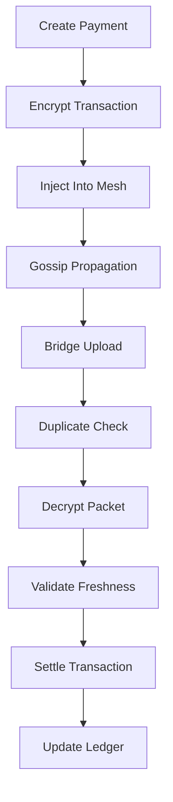
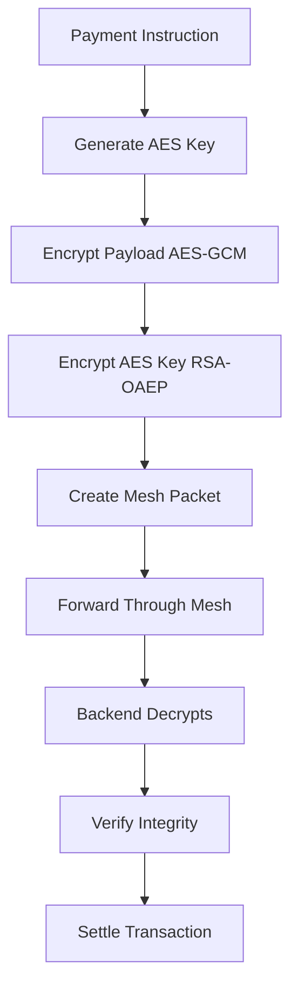

# MeshPay

## Offline UPI Mesh Payment Network Simulator

MeshPay is a Spring Boot-based backend system that demonstrates how digital payments can be routed through a mesh network when internet connectivity is unavailable. The project simulates encrypted transaction propagation between nearby devices and performs secure transaction settlement once a bridge node regains internet access.

This project was built to explore concepts in distributed systems, backend engineering, network communication, and secure transaction processing.

---

## Features

### Secure End-to-End Encryption

* Hybrid encryption using RSA and AES
* Secure key exchange with RSA-OAEP
* AES-GCM authenticated payload encryption
* Intermediate devices cannot view transaction contents

### Offline Payment Routing

* Simulated Bluetooth-style mesh network
* Device-to-device packet forwarding
* Gossip-based message propagation
* TTL-based packet expiration

### Exactly-Once Settlement

* SHA-256 transaction hashing
* Duplicate transaction detection
* Idempotent transaction processing
* Protection against concurrent duplicate uploads

### Replay Protection

* Timestamp validation
* Unique nonce generation
* Expired packet rejection

### Transaction Safety

* ACID-compliant settlement operations
* Optimistic locking support
* Consistent ledger updates

### Interactive Dashboard

* Create transactions
* Inject packets into mesh
* Run gossip rounds
* Upload packets through bridge nodes
* Monitor balances and transaction history

---

## Architecture

```mermaid
flowchart LR

A[Sender Phone<br/>Alice sends ₹500]
--> B[Encrypt Transaction<br/>RSA + AES]

B --> C[Mesh Packet<br/>Encrypted Payload]

C --> D[Phone A]
D --> E[Phone B]
E --> F[Phone C]

F --> G[Bridge Node<br/>Internet Available]

G --> H[Spring Boot Backend]

H --> I[SHA-256 Hash Check]
I --> J[Idempotency Validation]
J --> K[Decrypt Packet]
K --> L[Replay Protection]
L --> M[Settlement Service]

M --> N[(Ledger Database)]
```



---

## Workflow



---

## Security Design



---

## Technology Stack

| Category   | Technology        |
| ---------- | ----------------- |
| Language   | Java 17           |
| Framework  | Spring Boot       |
| Database   | H2 Database       |
| ORM        | Spring Data JPA   |
| Build Tool | Maven             |
| Security   | RSA-OAEP, AES-GCM |
| Frontend   | Thymeleaf         |
| Testing    | JUnit             |

---

## Project Structure

```text
src
├── main
│   ├── controller
│   │   ├── ApiController
│   │   └── DashboardController
│   │
│   ├── service
│   │   ├── MeshSimulatorService
│   │   ├── SettlementService
│   │   ├── BridgeIngestionService
│   │   └── IdempotencyService
│   │
│   ├── crypto
│   │   ├── HybridCryptoService
│   │   └── ServerKeyHolder
│   │
│   ├── model
│   │   ├── Account
│   │   ├── Transaction
│   │   ├── MeshPacket
│   │   └── PaymentInstruction
│   │
│   └── resources
│       ├── templates
│       └── application.properties
│
└── test
    └── IdempotencyConcurrencyTest
```

---

## Key Components

### MeshSimulatorService

Simulates a network of virtual devices and manages gossip-based packet propagation.

### HybridCryptoService

Handles encryption, decryption, key management, and packet hashing.

### BridgeIngestionService

Processes packets uploaded from bridge nodes and validates transaction authenticity.

### SettlementService

Performs debit-credit operations and records transaction history.

### IdempotencyService

Ensures duplicate packets are processed only once.

---

## API Endpoints

| Method | Endpoint           | Description            |
| ------ | ------------------ | ---------------------- |
| GET    | /                  | Dashboard              |
| GET    | /api/accounts      | Fetch accounts         |
| GET    | /api/transactions  | Fetch transactions     |
| GET    | /api/mesh/state    | View mesh state        |
| POST   | /api/demo/send     | Create payment         |
| POST   | /api/mesh/gossip   | Run gossip round       |
| POST   | /api/mesh/flush    | Upload packets         |
| POST   | /api/mesh/reset    | Reset mesh             |
| POST   | /api/bridge/ingest | Bridge upload endpoint |

---

---

## Future Improvements

* Real Bluetooth Low Energy communication
* Android client application
* Redis-based distributed idempotency cache
* PostgreSQL database integration
* JWT authentication
* Docker deployment
* Kubernetes support
* Real payment gateway integration

---

## Learning Outcomes

This project helped me gain hands-on experience with:

* Spring Boot Development
* Distributed Systems Concepts
* Network Communication Simulation
* Cryptography Fundamentals
* Concurrency Handling
* Transaction Management
* REST API Design
* Software Architecture

---

## Author

Tushar Bhardwaj

Computer Science Engineering (AI & ML)

Chandigarh University

Passionate about Backend Development, Distributed Systems, AI/ML, and Software Engineering.

